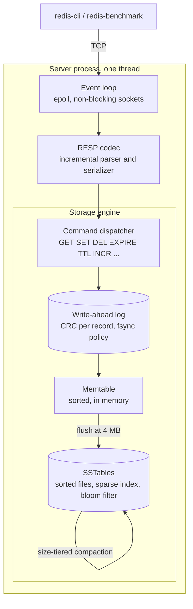

# cachedb

A persistent key-value store written from scratch in C++17 that speaks the Redis wire protocol. A stock `redis-cli` connects to it, `redis-benchmark` runs against it unmodified, and on durable writes it matches a real `redis-server` on the same machine.

Underneath it is a log-structured merge tree: a write-ahead log, a sorted in-memory table, immutable sorted files on disk with bloom filters, and size-tiered compaction. Single-threaded event loop on `epoll`, standard library only, no third-party code except a header-only test framework.

I built this to understand the parts of a database that are usually hidden behind a library: sockets, binary protocols, `fsync`, crash recovery, and on-disk data structures. Every number below was measured, and the ones that surprised me are explained.

## At a glance

| | |
|---|---|
| Durable writes, before and after group commit | 2,058 to **45,249 ops/sec** (22x), fsyncs per write 1.000 to **0.038** |
| Against real Redis, both fully durable, paired and repeated | ahead in **5 of 5** runs, ratio 1.05 to 1.08; reads a tie within 1% |
| Read cost with and without compaction | 303 files down to 9, **3.2x** throughput, **5x** better median latency |
| Bloom filter across 127 tables | **8.4x** faster hits, **12.2x** faster misses |
| Dataset larger than RAM | 1M keys, 114 MB on disk, served from **8 MB** of resident memory |
| Crash safety | `kill -9` mid-write, 10 of 10 runs, zero acknowledged writes lost |
| Tests | 9 unit test binaries under ASan and UBSan, plus an automated crash test |

## How it fits together



**A write** is parsed into a command, appended to the log, fsynced, inserted into the memtable, and only then acknowledged. If the log write fails the client gets an error and nothing in memory changes. When the memtable passes its size limit it is written out as a new sorted file and the log is truncated.

**A read** checks the memtable first, then each file on disk from newest to oldest. Each file is asked its bloom filter before anything is read from disk, and the first layer with an answer settles it. That last rule matters more than it sounds: a delete is stored as a tombstone rather than a removal, because the key may still exist in an older file, and the tombstone is the only thing hiding it.

## The storage engine

**Write-ahead log.** One record per mutation, little-endian, checksummed: `[crc32][timestamp][op][klen][vlen][key][value]`. On startup the log is replayed into the memtable before the server accepts a connection. Replay stops at the first record that fails its checksum and cuts the file there, because a log is ordered and applying record six after record five was torn can resurrect a key the client was told was deleted. Three fsync policies: `always` (default), `everysec`, and `no`.

**Memtable.** A sorted map with a three-way lookup: not here, here and live, or here and deleted. It tracks its own memory footprint including allocator overhead, because a naive estimate of key plus value bytes read 12% low against real resident memory and would have let the process hold more than its limit.

**SSTable.** An immutable sorted file: a data block, a sparse index with one entry per 4 KB of data, a bloom filter block, and a fixed footer with a magic string. A lookup is one filter check, one binary search in memory, and at most one `pread`. The reader validates every offset in the footer before it seeks, since a damaged file's claims about itself are not evidence.

**Bloom filter.** Ten bits per key, seven hash functions derived by double hashing from one 64-bit hash. The measured false positive rate lands on the theoretical curve at every setting tried, from 4 to 16 bits per key. Getting there needed a finaliser on the hash: without it the error rate depended on what the keys looked like.

**Compaction.** Size-tiered. Files whose sizes are within 2x of each other form a tier, and a contiguous run of four in one tier is merged with a k-way merge over a min-heap of file cursors. The merged file is written to a temp name and renamed over the newest input, so a crash at any point leaves either the old files or the new one, never a gap. Tombstones and expired entries are dropped only when the merge reaches the oldest file on disk, because anywhere else they may be the only thing hiding a live copy below.

**Expiry.** Lazy on read, and an active sweep on the event loop tick that walks a bounded slice of the memtable each time. The two solve different problems: lazy expiry is about correctness, the sweep is about memory. Every layer stores the expiry stamp raw and only one place compares it to the clock, so two layers can never disagree about what time it is.

## What was measured

All numbers are from `scripts/bench.sh` in the Docker container on an Apple Silicon Mac, release build, 50 clients. Sanitizers are off for benchmarks; the same workload under ASan reported 427 MB of memory where the real figure was 8 MB, which is worth knowing before believing any number from a debug build.

### Group commit: the headline

The first comparison against real Redis showed reads within 5% and durable writes 20x slower. Counting syscalls with `strace` gave the cause: cachedb issued one fsync per write, Redis issued 0.02. Redis is not less durable. It accumulates the writes that arrive in one turn of its event loop, fsyncs once, and only then releases their replies.

Doing the same thing here closed the gap:

| `--fsync always`, 20,000 writes | SET ops/sec | fsyncs per write | p50 | p99 |
|---|---|---|---|---|
| one fsync per write | 2,058 | 1.000 | 20.8 ms | 77.6 ms |
| group commit | **45,249** | **0.038** | **0.99 ms** | **2.4 ms** |

The durability promise did not change. A reply is the acknowledgement, so the server holds every reply for an iteration, fsyncs once, and only then writes to any socket. The crash test passes unchanged against it, which is the only evidence that actually settles that question.

### Against real Redis

Both servers fully durable: cachedb with `--fsync always`, Redis with `appendfsync always`. Same machine, same `redis-benchmark` workload of 20,000 writes from 50 clients with 100-byte values. Five repetitions, alternating which server ran first, because a single run of each turned out to be measuring how warm the machine was rather than the servers.

| repetition | cachedb SET | redis SET | ratio | cachedb p99 | redis p99 |
|---|---|---|---|---|---|
| 1 (warm-up) | 41,237 | 34,602 | 1.19 | 2.62 ms | 6.94 ms |
| 2 | 47,506 | 44,346 | 1.07 | 1.95 ms | 2.10 ms |
| 3 | 49,505 | 45,662 | 1.08 | 1.75 ms | 2.08 ms |
| 4 | 51,813 | 49,261 | 1.05 | 1.60 ms | 1.97 ms |
| 5 | 52,493 | 49,383 | 1.06 | 1.52 ms | 1.97 ms |

What each column is saying:

- **SET ops/sec** is how many durable writes each server completed per second. Durable means the client only got its `OK` after the write was fsynced to disk, so this is the number that the disk, not the CPU, sets the ceiling on. Higher is better. Around 50,000 per second means the server is not fsyncing per write; a disk cannot do that many. Both servers are batching, and the throughput shows how well.
- **Ratio** is cachedb divided by Redis within the same repetition. It is the number to trust, because both servers saw the same machine in the same state. Above 1.0 means cachedb finished more writes per second. It settles at 1.05 to 1.08, which is cachedb a few percent ahead, and it is stable across repetitions 2 to 5 even though the absolute numbers are not.
- **p99** is the time the slowest 1% of writes took, so 99 out of 100 writes came back faster than this. It is the number a user notices, since a busy site hits its worst case constantly. Lower is better. cachedb's tail is shorter in every repetition, at 1.5 to 2.0 ms against Redis's 2.0 to 2.1 ms once warm.
- **Repetition 1 is discarded** from both sides. Both servers are markedly slower and Redis's tail is three times worse, because the machine was still cold: caches empty, CPU clocks low. Judging either server on it would be unfair, so it is shown but not counted.
- **The absolute numbers climb** from repetition 2 to 5 on both sides. That is the machine warming up, not either server getting better. It is why one run of each cannot be compared, and why the paired ratio is quoted instead of any single throughput figure.

Reads are a tie: 208,959 against 210,651 ops/sec, under 1% apart and inside run-to-run noise. Reads never touch the disk when the data is in memory, so both servers are bounded by the same things: parsing the protocol and a hash or tree lookup. There was no reason to expect a difference and there is none.

This does not mean cachedb is a better database. Redis's append-only file carries a richer record, this is one workload of one value size on one filesystem, and Redis is doing work this project does not. What the measurement supports is that the durability path is no longer the bottleneck, which is exactly what it was built to show.

### Compaction

100,000 writes through `redis-benchmark` with a 100 KB memtable to force many flushes, then 50,000 random reads:

| | files | on disk | GET ops/sec | p50 | p99 |
|---|---|---|---|---|---|
| compaction off | 303 | 14 MB | 61,350 | 0.72 ms | 2.03 ms |
| compaction on | **9** | 9 MB | **195,312** | **0.14 ms** | 0.92 ms |

The median improves 5x and the tail only 2.2x, and that difference is the interesting part. Compaction removes work from every read, which is what the median client pays. A flush or a merge adds a stall, which only the client that collides with it pays, and removing per-read work cannot help someone stuck behind a stall.

### The cost of durability, and what the bloom filter saves

| fsync policy | throughput | p99 |
|---|---|---|
| `always`, before group commit | 2,909 ops/sec | 33.6 ms |
| `everysec` | 194,553 ops/sec | 0.38 ms |
| `no` | 200,803 ops/sec | 0.21 ms |

| reads across 127 files, cold cache | filter on | filter off |
|---|---|---|
| keys that exist | 97,087 ops/sec | 11,561 ops/sec |
| keys that never existed | 97,561 ops/sec | 7,990 ops/sec |

Misses gain the most, which is the shape a bloom filter is for: without it every miss reads a block from all 127 files.

### Things that were wrong before they were right

Every one of these was caught by re-measuring something that looked off, and each taught me more than the table it corrected.

- The first read-amplification run showed no difference between 0 and 15 files. Everything fit in the page cache, so no read touched a disk. Dropping the cache between runs is the difference between measuring an LSM tree and measuring `memcpy`.
- Bloom filter effectiveness was first measured as hits against misses, and misses came out slower, which read as the filter being useless. A hit stops at the first file that has the key while a miss consults every filter. Only switching the filter off measures what it saves, which is why `--no-bloom` exists.
- A single run of each server said cachedb was within 1.4% of Redis. Repeating it showed both arms climbing monotonically as the machine warmed. Comparisons must be interleaved and repeated, with a warm-up discarded from both sides.

## Crash safety

`scripts/crash_test.sh` writes keys through `redis-cli`, sends `kill -9` to the server at a random point in the write stream, restarts it, and requires every key the client was told was written to come back with the right value. The assertion is deliberately one-directional: acknowledged implies present. A key can be durable without being acknowledged, since the server can fsync a record and die before the reply is sent. Losing a reply is a disappointment. Losing an acknowledged write is a broken database.

The test has two phases, because `kill -9` cannot do everything. A 35-byte record is copied into the page cache in one step a signal cannot interrupt, so a killed process essentially never leaves a torn record. Only a power cut does. Phase two models that by cutting a few bytes off the end of the log after the kill, and requires recovery to report the discard and keep every key before it.

Both assertions were checked against deliberate sabotage, because a test that cannot fail proves nothing. Deleting the log before restart is caught. Cutting 200 bytes instead of 19 is caught.

Two ordering bugs that the test could not have found are worth mentioning, since finding them meant reading the manual rather than running the suite. Fsyncing a file does not make the directory entry naming it durable, so a flush that synced a whole table and then truncated the log could still lose the table to a power cut. And a flush that wrote straight to its final filename could leave a half-written file that the strict reader refused to open at the next start, with every acknowledged write still safe in the log. Both are fixed: the directory is fsynced before the log is cut, and a flush is assembled under a temp name and renamed into place only once complete, the same swap compaction uses.

## Testing

- Nine unit test binaries, one per component, built with `-Wall -Wextra -Werror` and run under AddressSanitizer and UndefinedBehaviorSanitizer by default. The RESP parser is fed byte by byte and must produce the same result as being fed whole.
- Negative controls for the rules that matter. A version of the sweep that erases instead of marking fails the resurrection test. A version of compaction that takes the highest sequence number instead of the newest input's passes until the test restarts the store, which is when the order is rebuilt from filenames, and then fails on exactly the line written for it.
- Compatibility checked side by side with a live `redis-server`: 26 of 27 replies byte-identical, error strings included. The one difference is deliberate and listed below.

## Build and run

The server is Linux-only because it uses `epoll`. On macOS, CMake builds the engine and the whole test suite and skips only the server, so everything except the socket layer is testable on a Mac. The Dockerfile provides a Linux toolchain with `redis-cli`, `redis-benchmark`, and a real `redis-server` to measure against.

```sh
docker build -t cachedb-dev .
docker run --rm -it -v "$PWD":/cachedb cachedb-dev

# inside the container
cmake -S . -B build-linux && cmake --build build-linux -j
ctest --test-dir build-linux --output-on-failure
./build-linux/cachedb &
redis-cli set foo bar
redis-cli get foo
./scripts/crash_test.sh
```

For benchmarks, build without sanitizers and use `scripts/bench.sh`:

```sh
cmake -S . -B build-rel -DCACHEDB_SANITIZE=OFF -DCMAKE_BUILD_TYPE=Release
cmake --build build-rel -j
./scripts/bench.sh
```

Flags: `--port`, `--dir`, `--fsync always|everysec|no`, `--memtable-limit BYTES`, and three benchmark-only switches that turn optimizations off so the "before" half of each measurement stays reproducible: `--no-bloom`, `--no-compaction`, `--no-group-commit`. The server binds loopback only, since there is no authentication.

## Commands

`PING`, `SET` with `EX` and `PX`, `GET`, `DEL`, `EXISTS`, `EXPIRE`, `TTL`, `INCR`, `FLUSHALL`, `INFO`, and the `CONFIG GET` and `COMMAND` stubs that `redis-benchmark` and `redis-cli` send on connect. Inline commands work too, so `nc` is enough to poke at it.

Integer parsing is strict in the same way Redis is: `INCR` on a value of `007` is an error, because Redis requires a number to round-trip to the bytes it came from. That one was found by comparison against a real server, not by reading. `SET k v NX` is refused rather than silently performing an unconditional write, and is the only reply that differs from real Redis across the 27 checked.

## Decisions I would defend

- **Single-threaded.** Same model as Redis. There is no lock on any hot path, and correctness reasoning stays tractable. Compaction and flushes block the loop on purpose, so their cost to tail latency is a number rather than something hidden on a background thread.
- **The log write precedes the memtable insert.** Crash between them and replay puts the write back. The other order can lose an acknowledged write, which is the one outcome a database may not have.
- **Tombstones are never dropped early.** Three separate mechanisms enforce the same rule: a delete, an expired entry, and a compaction that has not reached the oldest file all stop a search rather than let it fall through.
- **fsync errors are not retried.** Linux reports a writeback error once and then clears it, so a second fsync can return success over data that is gone.
- **The sparse index is spaced by bytes, not by keys.** The index exists to bound how far a lookup scans after seeking, and that distance is measured in bytes.
- **`DEL` costs what `GET` costs.** Its reply count asks whether the key was visible a moment ago, and in a layered store only a full read knows. RocksDB avoids the question by returning nothing at all.

## Scope

Deliberately not here: replication, clustering, data types beyond strings, pub/sub, transactions, authentication, TLS. Each is out of scope so the parts that are here could be done properly.

Not yet done, in the order I would do them: a skip list measured against `std::map` for the memtable, a property test that runs random operations against a reference model, edge-triggered epoll measured against level-triggered, and a fuzzer for the parser. Each is a before-and-after measurement waiting to happen rather than a missing feature.

## Layout

```
src/
  server.cpp      epoll loop, accept, group commit, shutdown
  connection.cpp  per-connection buffers, partial reads and writes
  resp.cpp        RESP parser (state machine) and serializer
  command.cpp     dispatch table and handlers
  store.cpp       the front door: durability, flush, and search order
  wal.cpp         record format, CRC, fsync policies, replay
  memtable.cpp    sorted table with footprint tracking and the expiry sweep
  sstable.cpp     writer, reader, and a cursor for merges
  bloom.cpp       bit array, double hashing
  compaction.cpp  k-way merge over a min-heap
tests/            one binary per component
scripts/          crash_test.sh and bench.sh
```
